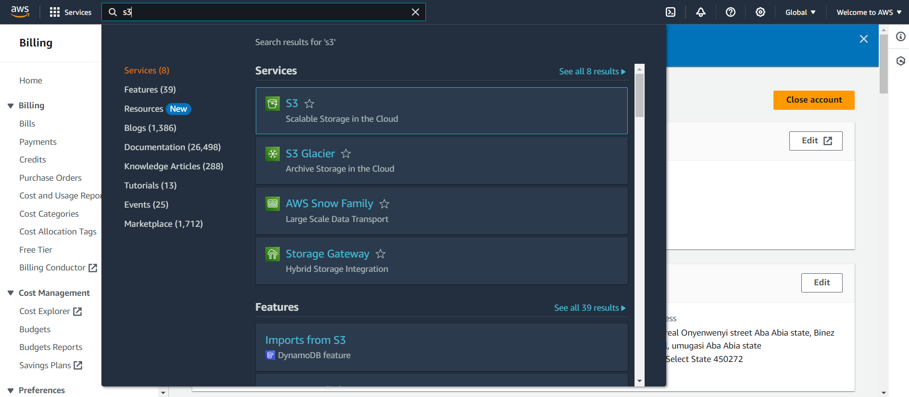
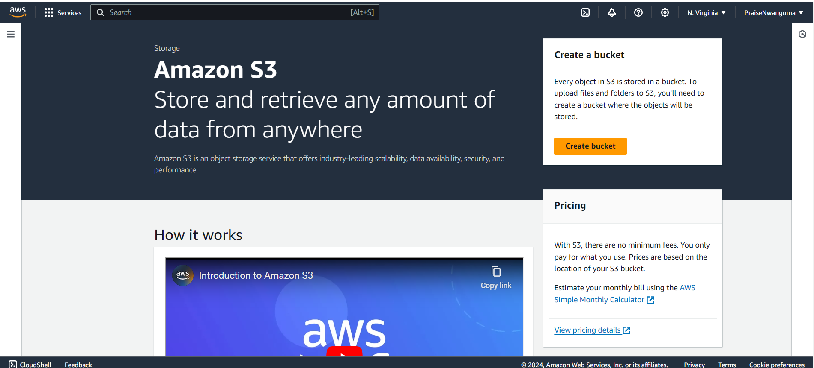
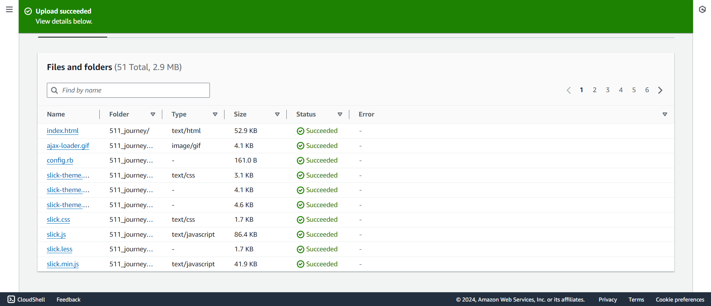
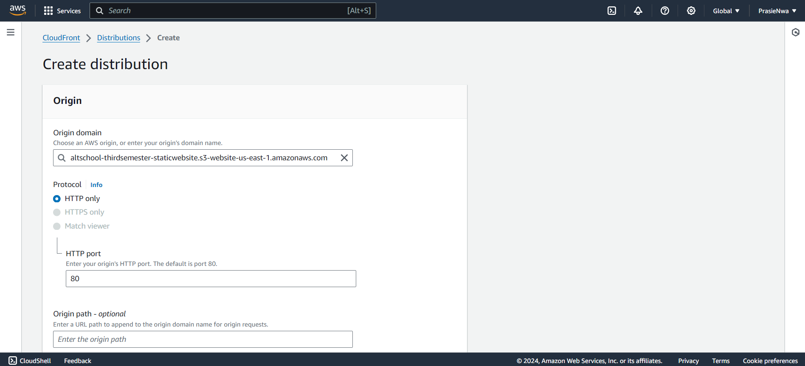

# Deploy a static website with S3 Bucket and Cloudfront
## TASK - 
Create a static website and host it on S3 bucket(private bucket) but with public read policy assigned, using cloud front for CDN.

The requirements to carry this out is an AWS account and a folder that contains the static web files.

a) Firstly, I logged into my by AWS console, clicked on services and searched for S3. Click on S3 and click the Create bucket option to create a new bucket.

b) Next step is to give then newly created bucket a name. This name has to globally unqiue or you will recieve an error that the name already exist.

c) Scroll down a little bit and uncheck "block all public access".Also remember to tick the warning below 'I acknowledge that the current settings might result in this bucket and the objects within becoming public'

d) Leave the other options as they are then click create bucket at the buttom of the page.

e) After clicking on the create bucket. You will see the name of the bucket you created. click the bucket.

f) At this point you will need to upload files into this bucket that has just been created. Click on the upload option.

'

g) Click the 'Add files/Add folder' option. Then locate the files for the static website you wish to host. scroll to the buttom of the page and click upload

h) You will be able to view the process of this upload and see a confirmation message when it is done uploading. Look through the files to be sure all the web documents uploaded without any error. Click the close button after this

**Step 2 - Enabling Static Website Hosting on S3 Bucket**

a) At the bucket overview page, click on the properties and scroll down to static web hosting. Click on edit. Enable static web hosting. Specify the index document. this is usually index.html by convention. Then specify the error message.

scroll down to the buttom of the page and click save changes

**Step 3 - Add a Bucket Policy**

a) Go back to the bucket overview page one more time and click on permissions. Then edit the bucket policy and populate it with this contents. Make sure you change the resource here to bare the unqiue name you gave you S3 bucket. scroll down and click on save changes.

Go back to the bucket overview page and click properties. At the buttom of this page you will see the endpoint link for the S3 bucket you have just hosted. copy this link and paste in you web browser. The site should be rendered at this point

**Step 4 - Creating a CloudFront Distribution**
a) Tap on Services at the top navigation bar in your AWS console. Search for CloudFront. Click it.

b) Click on create distribution. Under Origin domain input the Amazon S3 static website endpoint. The name will be generated automatically for you. Under Original access choose public. Leave other settings to the default under this section.

c) Scroll to the bottom of the page and specify Document root object as index.html. Then create distribution. 

d) CloudFront will now distribute all your files to edge locations around the world. This process will take some time to complete.

e) When the process has been completed, you can copy the 'distribution domain name' and paste it into your browser to render your static website.

This is how the site looks like on my end.

